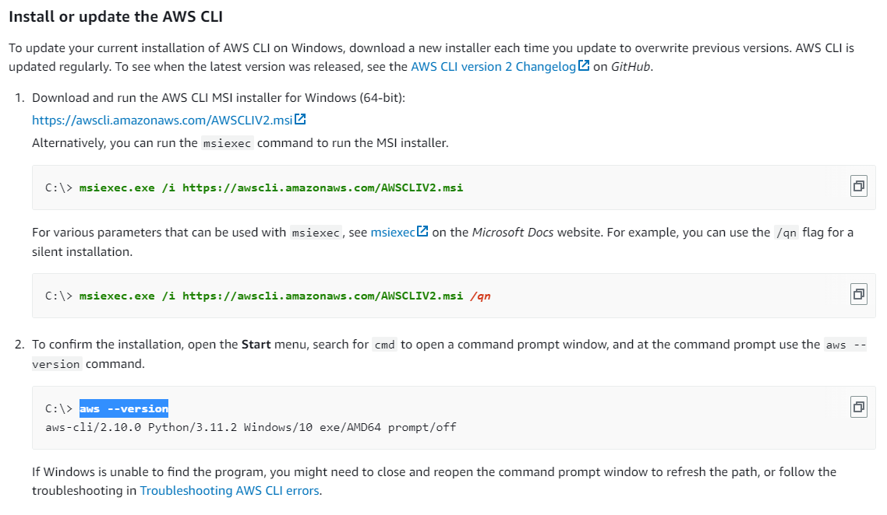
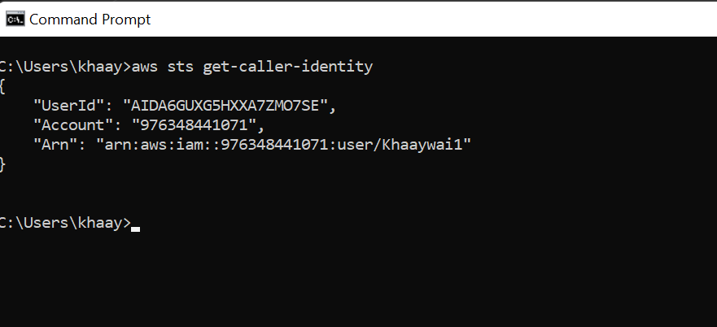

# Week 0 — Billing and Architecture

## Required Homework/Tasks

### Install AWS CLI 
I was able to install the AWS CLI on gitpod and my Windows machine, evidences are presented below:
- Gitpod evidence: Please review my gitpod.yml file using [this link](https://github.com/khaaywai/aws-bootcamp-cruddur-2023/blob/5b80dc9f1eb6f183548ace515d591a792a412476/.gitpod.yml)
- Windows Evidence
  - Followed the instructions in 
  - Evidence of aws command working 
  - Evidence of aws --version command 

While building the chart, I faced a challenge, I couldn't find the momento logo in Lucid shapes. I resolved this by using an online converter to convert a screenshot of the logo to SVG format, and then import the svg file into Lucid.
